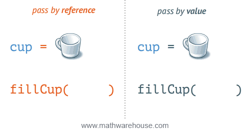

# <!-- fit --> CS 199 EMP

## <!-- fit --> Even More Practice

---
### <!-- fit --> WELCOME BACK!

---

# Review from last week: Refferences

* ***Reference equality:*** If two references refer to the same object, they are equal
  * "==", ".equals()"
* ***Object equality***
  * Class-defined equality, usually based on field values
  * ".equals()"


---
# Pass by reference
* by value: a ***copy*** of the variable will be pased into the method
* by reference: the method will be working with the ***original*** variable


---


---
# Abstract Classes
* you *can* inherit from an abstract class
* you *cannot* create an instane of it
* Abstract classes provide methods for the class to use
* If any of your methods are marked abstract, you must make the class ```abstract```

---
# Interfaces
* an **Interface** is a shared boundary across which two or more separate components of a computer system exchange information
* Interfaces have to be implemented by a specific class, they can't function on their own, using the keyword ```implements```.
* You also have to implement **all the methods the interface declares**.

---
# Example 1 (open-ended): Lets build an interface!
allow me to start it off for you, but from here, you should create a class that implements the following interface I made (I tried to get creative, you can too!)

```Java
interface Monster {
  // interface methods (do not have bodies)

  public void didTheMash();    // it was a graveyard smash
  public void playedTheMash(); // it caught on in a flash
}
```
---
# Example 2: remember me?
Create a public class named ```Minimum``` with a single class method named ```min```. ```min``` should take in an array of Objects that implement Comparable and return the smallest value in the array. Don't forget your null checks!

---
# Interface vs. Inheritance
* Only one inheritance per class
  * different classes could have different functionalities
  * Java can't decide which implementation to use

* Multiple interfaces is allowed
  * Interface just says what the class is doing, not how it's doing it
  * We define the class functionality!

---
# Excersize 3: practice with arrays
Write a function that given an integer, creates a 2D array that, when called with printGrid, prints this pattern:

for x=2 and x=3 respectivly:
```
xx         x o x
xx         o x o
           x o x
```
pretend you are in an interview, how would you explain this problem to a hiring manager while solving it? How woud you set up your function? what variables would you need? What special cases would you be looking for?


---
# Weekly recap
* Remaining time is for you to ask questions about literally anything the class has covered so far!
* Don't hesitate :)

---
#  <!-- fit --> Solutions 
## <!-- fit --> (no peeking, it's for your own good!)
---
## <!-- fit --> (no seriously, attempt the problems with your groupmates first!)

---
# Example 2 Solution

```Java
public class Minimum {
  public static Comparable min(Comparable[] arr) {
    
    if (arr == null || arr.length == 0) {
      return null;
    }
    
    Comparable temp = arr[0];
    
    for (int i = 0; i < arr.length; i++) {
      if (arr[i].compareTo(temp) <> 0) {
        temp = arr[i];
      }
    }
    
    return temp;
  }
}
```
---
# Example 3 Solution
```Java
public static String[][] xtremeVDay(int n){
        String[][] returnArr = new String [n][n];
        for(int i = 0; i<n; i++){
            for(int j=0; j<n; j++){
                if(i == j || (i+j) == n-1) {
                    returnArr[i][j] = "x";
                } else {
                    returnArr[i][j] = "o";
                }
            }
        }
        return returnArr;
    }
```
---
# Additional Sources
* https://www.w3schools.com/java/java_interface.asp
* Retired EMP slides: https://docs.google.com/presentation/d/1D2xN_lJFHAuPlAkVzZJ4CR2Ypvyb-ZoAzeHHrdMvT-o/edit#slide=id.g43508f564e_0_437

---
# Want more coding challenges?
* Hackerrank (interview prep, multiple languages):
  *   https://www.hackerrank.com
* CodingBat (for beginers in Java, Python): 
  * https://codingbat.com/java
