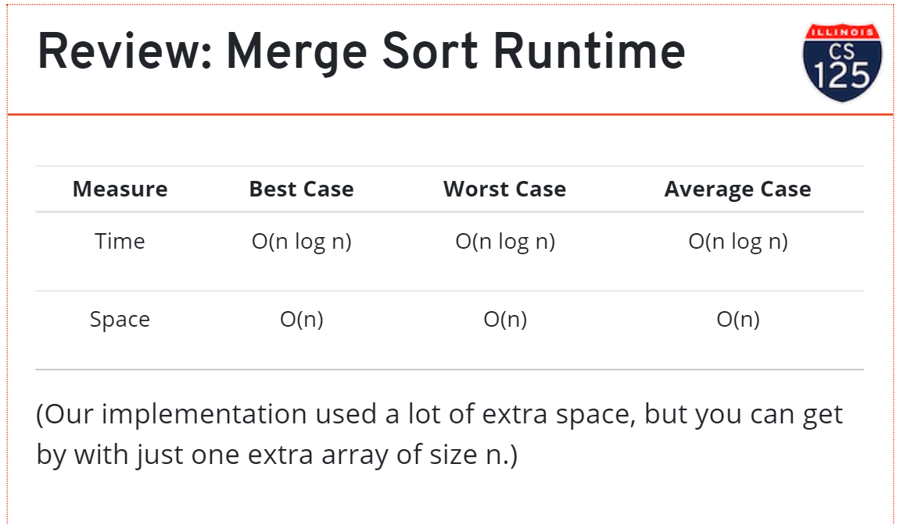
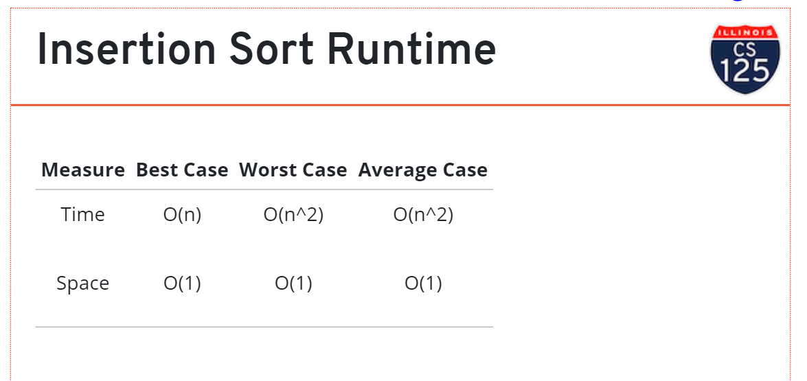
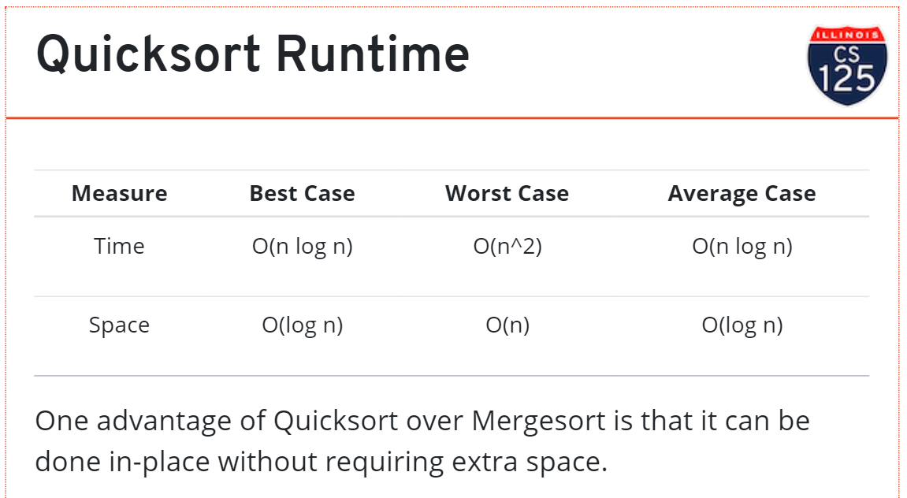

# <!-- fit --> CS 199 EMP

## <!-- fit --> Even More Practice

---

# <!-- fit --> Attendance Link:

https://forms.gle/8yto1LvJ4hntiKNu7

---

# 2 meetings every week Tuesday and Thursday

* Early CST - Early risers and Eastern timezones

* Evening CST - Western timezones (and really late Eastern folks)

* Calendar contains zoom links

* Attend 7 sessions for credit, attendence via google form.

---

# Format

* 3 practice problems every session

* focused on practical understanding of concepts covered recently in class

* slides and material available after both sessions

--- 

# How to follow along

* Small breakout rooms of working together 

* Work for 10-15 minutes together, feel free to use paper, whiteboards, online share tools.

* Use the code playground on the 125 homepage for the interactive running

---
# Review: How to approach recursive problems

* Eventually everything will eventually hit the base case, so after that you have to do the right step to put it back. 

* Sometimes this is adding, sometimes multiplying, sometimes taking the min/max.

* In the case of factorial recursive, it's the multiplying of all the results together that works.

* $5! = 5 * 4! = 5 * 4 * 3! = 5 * 4 * 3 * 2! =  5 * 4 * 3 * 2 * 1! = 5 * 4 * 3 * 2 * 1 * 0! = 5 * 4 * 3 * 2 * 1 * 1$

* Once everything hit the base case now all the results just multiply to give us our result of $120$


---

# Binary tree data structure

* This class we work with the simplest type of trees called binary trees. 

* Each node has a left node and a right node, they both don't have to be filled out but there never can be more of these.

* A tree is a type of recursive data structure, that means that even the nodes are trees themselves, so it's right to think about each tree being made up of a left subtree and right subtree.

* Since it is a recursive data structure, trees are great for recursive algorithms and trying to do these problems iteratively will be far more complex. This means your code for doing stuff like this will often be short, but tricky to figure out.

* It gets better with practice :)


---
# Full binary tree (10 minutes)
Given a Tree, return a list of all the node values that are single leaves. (single meaning they are the only leaf corresponding to a parent node, Right or Left, but not both)


```java
public class Tree {
  int value;
  Tree left;
  Tree right;
}

public static List<Integer> FindSingleLeaves(Tree t) {
  List singleLeaves = new ArrayList();
  return singleLeaves
}
```

---
# Sorting
* Simply put, sorting algorithims are ones designed to sort a list of items in order
  * Numerical
  * Alphabetical
* Cool thing to watch: https://www.youtube.com/watch?v=WaNLJf8xzC4


---
# Why do we sort?
Sorting algorithims make it easier for us to index through all sorts of data
* dewey decimal system: sorts non-fiction books in order
  * Fiction books are sorted by author's last name.
* Students in a gradebook, sorted by netid
* The People page on the 125 website, sorted by first name (in each category)

---
# Common sorting algorihims and their runtimes
(As told by geoff's old slides)

---

https://en.wikipedia.org/wiki/Merge_sort

---

https://en.wikipedia.org/wiki/Insertion_sort


---

https://en.wikipedia.org/wiki/Quicksort


---
# Anagram (10 minutes)
Given two strings s and t , write a function to determine if t is an anagram of s.
```Hint: Try to see how using Arrays.sort() could help you solve this faster```

```Java
public boolean isAnagram(String s, String t) {

}
```
see: https://www.geeksforgeeks.org/arrays-sort-in-java-with-examples/

---
# Pet Shop, but for chuchu (10 minutes)
Geoff has given Chuchu an allowance for being a good boi. Chuchu now wants to use the money he has saved up to buy as many chew toys as he can. as he chew-chews through a lot of them. You are given Chuchu's allowance and an array of the toys and their prices (you can assume that every item in the store's inventory has its own price int in the array, so duplicates exist). Return the max number of toys chuchu could buy.
Solve this with sorting!

```
3 bones ($5 each), 1 rope ($2 each), 2 plushies($3 each) would look like
[5, 5, 5, 2, 3, 3]

If chuchu had 9 dollars, the most he could get in this example would be 1 rope, and two plushies, return 3
```

```Java
int MaxToys(int allowance, int[] toyInventory) {
  int toyCount = 0;
  return toyCount;
}

```


---
#  <!-- fit --> Solutions 
## <!-- fit --> (no peeking, it's for your own good!)

---
## <!-- fit --> (no seriously, attempt the problems with your groupmates first!)

---
### 1)

---
### 2)

---
### 3)
